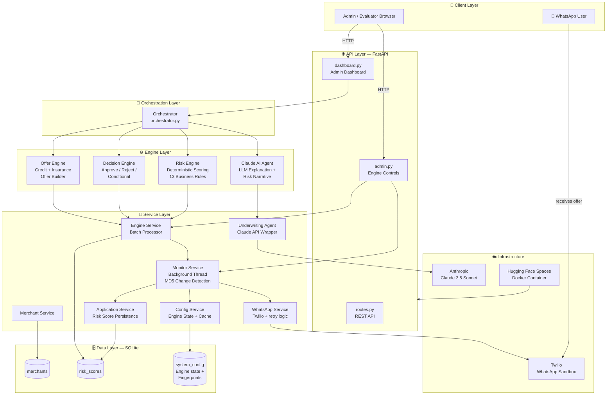
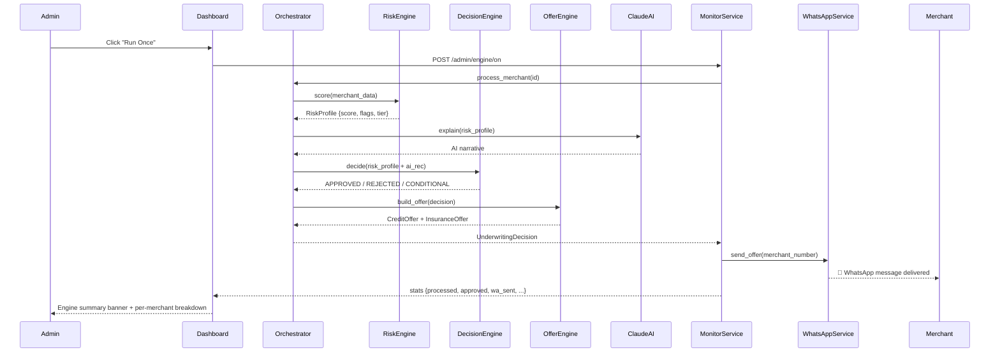
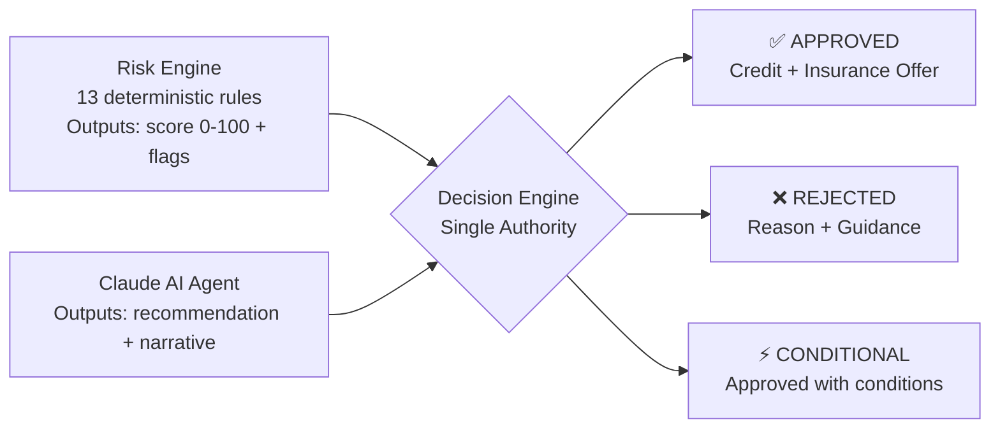

# 🤖 GrabOn AI Merchant Underwriting Agent

> **Production-deployed** AI underwriting system — risk scoring, Claude AI decisions, and real WhatsApp offer delivery.
> Live at → **[huggingface.co/spaces/AI-Solutions-KK/grabon-ai-merchant-underwriting-agent](https://huggingface.co/spaces/AI-Solutions-KK/grabon-ai-merchant-underwriting-agent)**

---

## 📲 Live WhatsApp Test — 3 Steps

> **Evaluators:** You can receive a real WhatsApp underwriting offer message in under 60 seconds.

| Step | Action |
|------|--------|
| **1. Join Sandbox** | Scan the QR code on the dashboard or send `join shop-observe` to **+1 415 523 8886** on WhatsApp |
| **2. Add Your Number** | On the dashboard, click ✏️ next to any approved merchant and enter your number (e.g. `9876543210`) |
| **3. Run Engine** | Click **▶ Run Once** — if the merchant is APPROVED, you'll receive a live WhatsApp offer message |

---

## 🏗️ System Architecture



---

## 🚀 Overview

This system automates merchant underwriting for **GrabCredit** and **GrabInsure** products. It takes raw merchant data, runs it through a deterministic risk scoring pipeline, gets an AI-generated explanation from Claude, makes a final credit/insurance offer decision, and delivers the offer directly to the merchant via **WhatsApp** — all from an admin dashboard with **real-time engine controls**.

### What makes this production-grade (not a demo):
- ✅ **Real WhatsApp delivery** via Twilio sandbox — not mocked
- ✅ **Real Claude AI calls** — not canned responses
- ✅ **Persistent SQLite DB** — state survives restarts
- ✅ **MD5 fingerprint change detection** — re-processes only changed merchants
- ✅ **Background daemon engine** with 60s polling (`ALWAYS_ON` mode)
- ✅ **Docker-containerized** and deployed on Hugging Face Spaces
- ✅ **Rate limit detection** with human-readable error reporting
- ✅ **Idempotent runs** — won't spam merchants already messaged

---

## 🧠 High-Level Flow

---

## 🏗 System Architecture

### 1️⃣ External Layer
- WhatsApp User

---

## 🔄 Decision Flow



---

## ⚙️ Engine Modes

The underwriting engine has **3 operating modes** controlled from the dashboard:

| Mode | Behaviour |
|------|-----------|
| **▶ Run Once** | Synchronous single-pass. Clears cache → processes all merchants → returns summary. Blocks until complete. |
| **∞ Always ON** | Starts a background daemon thread that polls every 60 seconds. Only re-processes merchants whose data has changed (MD5 fingerprint check). |
| **⏹ OFF** | Stops the background thread immediately. |
| **Clear Cache** | Wipes all MD5 fingerprints + resets `whatsapp_status`. Next run treats all merchants as fresh. |

### Change Detection Logic
Each merchant is fingerprinted across **13 fields** (revenue, GMV, chargeback rate, mobile number, etc.) using MD5. Stored in `system_config` as `fp_{merchant_id}`. A run only triggers Orchestrator + WhatsApp for merchants whose fingerprint differs from last run.

---

## 🎯 Decision Authority Model



**Only the Decision Engine produces final outcomes.** Risk Engine and Claude AI are inputs only — this eliminates distributed decision ambiguity and ensures full auditability.

---

## 📊 Risk Scoring — 13 Business Rules

| Factor | Weight | Notes |
|--------|--------|-------|
| Monthly Revenue | 20% | Tiered thresholds |
| GMV | 15% | Gross merchandise volume |
| Chargeback Rate | 15% | Hard reject >5% |
| Business Age | 10% | Stability signal |
| Transaction Volume | 10% | Activity level |
| Return Rate | 10% | Quality signal |
| Customer Rating | 8% | NPS proxy |
| Dispute Count | 7% | Risk indicator |
| + 5 more | — | Category, payment mix, etc. |

Final score 0–100 → maps to: `LOW` / `MEDIUM` / `HIGH` / `CRITICAL` risk tier.

---

## 🌟 Unique Features

| Feature | Detail |
|---------|--------|
| **3-State Engine Control** | ON / OFF / ALWAYS_ON with background thread daemon — no page refresh needed |
| **MD5 Change Detection** | Re-processes only changed merchants — idempotent at scale |
| **Inline Mobile Edit** | Click ✏️ on dashboard → edit number in-place → auto-sends WA if merchant is APPROVED |
| **Per-Merchant WA Breakdown** | Expandable report card shows `sent` / `failed` / `skipped` per merchant with reason |
| **Human-readable Error UX** | Twilio error codes (63038, 63007, 21211, 20003) mapped to plain English toasts |
| **Rate Limit Guard** | First 63038 sets `_rate_limited` flag → skips all subsequent Twilio calls in that cycle (10× faster) |
| **Live WhatsApp Test QR** | Evaluators scan QR → join sandbox → receive real offer in <60s |
| **REJECTED Guard** | Orchestrator blocks WhatsApp dispatch for rejected merchants — no erroneous alerts |
| **Engine Summary Banner** | After every run: processed/approved/rejected/wa_sent/wa_failed/wa_skipped + amber notice on rate limit |
| **Docker + HF Spaces** | One-command deploy — persistent SQLite, no external DB required |

---

## 🐛 Problems Faced & How They Were Solved

| # | Problem | Root Cause | Solution |
|---|---------|-----------|----------|
| 1 | **WA messages never received** | Twilio sandbox 50 msg/day cap (error 63038) hit silently | Added 63038 to `_NO_RETRY_CODES`; hard-fail skips retry loop entirely |
| 2 | **Stats showed false `wa_sent`** | `bool("N/A") == True` — Twilio failure returns `sid="N/A"` | `sid not in ("N/A", "", None)` guard added to `wa_ok` check |
| 3 | **ALWAYS_ON banner always stale** | `last_engine_summary` was only written by Run Once path, not background thread | `_run_cycle()` now writes summary itself — both modes update dashboard |
| 4 | **Background thread died on `--reload`** | Uvicorn `--reload` forks a new process, killing daemon threads | Removed `--reload` from production; Run Once made fully synchronous |
| 5 | **Red popup with raw Twilio blob** | Raw exception message passed to toast directly | `humanizeWaError()` JS function maps error codes to plain English |
| 6 | **Merchants re-messaged on every run** | No deduplication between runs | MD5 fingerprint stored per merchant in `system_config` table |
| 7 | **Engine ran even when REJECTED** | Orchestrator didn't check prior decision state | REJECTED guard added — skips WA dispatch if decision is REJECTED |
| 8 | **Port conflict on HF Spaces** | FastAPI defaulting to 8000, HF requires 7860 | `CMD` in Dockerfile updated to `--port 7860` |
| 9 | **`aiofiles` missing in Docker** | `StaticFiles` mount requires `aiofiles` implicitly | Added `aiofiles>=23.2.1` to `requirements.txt` |
| 10 | **`python-multipart` missing** | FastAPI `Form` parameters require it | Added `python-multipart==0.0.22` to `requirements.txt` |
| 11 | **Rate limit cycle took 60+ seconds** | 2s × 2 retry per merchant on 63038 = 2 min for 10 merchants | `_rate_limited` flag skips all subsequent Twilio calls in that cycle |
| 12 | **Error toast disappeared before read** | Error toasts had same 3.5s timeout as success | Error toasts now 7s; success stays 3.5s |

---

## 🗂 Project Structure (Active Files)

```
grabon-assignment/
├── Dockerfile                          # HF Spaces Docker deploy
├── requirements.txt                    # Pinned production deps
├── alembic.ini                         # DB migrations config
├── .env                                # API keys (not committed)
├── .env.example                        # Template for env setup
│
├── app/
│   ├── main.py                         # FastAPI app + lifespan + routers
│   │
│   ├── api/
│   │   ├── routes.py                   # REST underwriting endpoints
│   │   ├── dashboard.py                # Admin dashboard + inline edit
│   │   └── admin.py                    # Engine control endpoints
│   │
│   ├── engines/
│   │   ├── risk_engine.py              # 13-rule deterministic scorer
│   │   ├── decision_engine.py          # Final decision authority
│   │   └── offer_engine.py             # Credit + insurance offer builder
│   │
│   ├── orchestrator/
│   │   └── orchestrator.py             # Pipeline coordinator
│   │
│   ├── services/
│   │   ├── monitor_service.py          # 3-state engine + MD5 change detection
│   │   ├── engine_service.py           # Batch merchant processor
│   │   ├── merchant_service.py         # Merchant CRUD
│   │   ├── application_service.py      # Risk score persistence
│   │   ├── config_service.py           # system_config key-value store
│   │   ├── whatsapp_service.py         # Twilio WA with retry + rate limit guard
│   │   └── underwriting_agent.py       # Claude AI wrapper
│   │
│   ├── models/
│   │   ├── merchant.py                 # Merchant SQLAlchemy model
│   │   ├── risk_score.py               # Risk score + WA status
│   │   └── system_config.py            # Engine state + fingerprints
│   │
│   ├── schemas/
│   │   ├── merchant_schema.py          # Merchant Pydantic schema
│   │   └── decision_schema.py          # Decision + offer schemas
│   │
│   ├── db/
│   │   ├── base.py                     # SQLAlchemy declarative base
│   │   ├── session.py                  # Engine + SessionLocal
│   │   └── init_db.py                  # Table creation + seeding
│   │
│   ├── scripts/
│   │   └── seed_merchants.py           # Seeds 10 test merchants
│   │
│   └── templates/
│       ├── merchant_list.html          # Main dashboard (segmented engine UI)
│       └── merchant_detail.html        # Individual merchant detail view
│
└── tests/
    ├── test_decision_engine.py
    └── test_risk_engine.py
```

---

## 📦 Tech Stack

| Layer | Technology |
|-------|-----------|
| **Framework** | FastAPI 0.110 + Uvicorn 0.27 |
| **ORM / DB** | SQLAlchemy 2.0 + SQLite |
| **AI** | Anthropic Claude 3.5 Sonnet |
| **Messaging** | Twilio WhatsApp Business API |
| **Templating** | Jinja2 3.1 |
| **Validation** | Pydantic v2 |
| **Migrations** | Alembic 1.13 |
| **Deployment** | Docker + Hugging Face Spaces |
| **Python** | 3.11-slim |

---

## 🔧 Local Setup

```bash
# 1. Clone
git clone https://huggingface.co/spaces/AI-Solutions-KK/grabon-ai-merchant-underwriting-agent
cd grabon-ai-merchant-underwriting-agent

# 2. Virtual environment
python -m venv .venv
.venv\Scripts\activate        # Windows
# source .venv/bin/activate   # Linux/Mac

# 3. Install dependencies
pip install -r requirements.txt

# 4. Configure environment
cp .env.example .env
# Edit .env with your API keys (see below)

# 5. Run (no --reload — required for background threads)
python -m uvicorn app.main:app --port 8000

# 6. Open dashboard
# http://localhost:8000/dashboard
```

### Required `.env` Keys

```env
# Database
DATABASE_URL=sqlite:///./underwriting.db

# Claude AI
ANTHROPIC_API_KEY=sk-ant-...
CLAUDE_MODEL=claude-3-5-sonnet-20241022

# Twilio WhatsApp
TWILIO_ACCOUNT_SID=ACxxxxxxxxxxxxxxxxxxxxxxxxxxxxxxxx
TWILIO_AUTH_TOKEN=xxxxxxxxxxxxxxxxxxxxxxxxxxxxxxxx
TWILIO_WHATSAPP_NUMBER=whatsapp:+14155238886

# App
SECRET_KEY=your-secret-key-here
APP_ENV=production
```

---

## 🐳 Docker

```bash
# Build
docker build -t grabon-underwriting .

# Run (maps HF port 7860 → local 8000)
docker run -p 8000:7860 \
  -e ANTHROPIC_API_KEY=sk-ant-... \
  -e TWILIO_ACCOUNT_SID=ACxxx \
  -e TWILIO_AUTH_TOKEN=xxx \
  -e TWILIO_WHATSAPP_NUMBER=whatsapp:+14155238886 \
  grabon-underwriting
```

---

## 🔒 Production Considerations

- **No `--reload`** in production — kills background daemon threads
- **SQLite persistence** — `underwriting.db` persists across container restarts on HF Spaces
- **Idempotent engine runs** — MD5 fingerprints prevent duplicate WA messages
- **Rate limit short-circuit** — 63038 triggers `_rate_limited` flag, skips remaining Twilio calls
- **REJECTED guard** — approved-only WhatsApp dispatch, no false notifications
- **Claude retry policy** — exponential backoff with timeout on LLM calls
- **Structured DB state** — all engine decisions persisted in `risk_scores` table
- **Webhook idempotency** — signature validation, deduplication guard

---

## 📈 Development Phases

| Phase | Deliverable |
|-------|-------------|
| **Phase 1** | Architecture design, project scaffold, DB models |
| **Phase 2** | Risk Engine (13 rules), Decision Engine, Offer Engine |
| **Phase 3** | Claude AI integration, Orchestrator pipeline wiring |
| **Phase 4** | WhatsApp delivery via Twilio, message formatting |
| **Phase 5** | Admin Dashboard, Jinja2 templates, merchant table |
| **Phase 6** | Engine Service, batch processing, 10 seeded merchants |
| **Phase 7** | Inline mobile edit, AJAX save, immediate WA on edit |
| **Phase 8.1** | Monitor Service, MD5 change detection |
| **Phase 8.2** | 3-state engine (ON/OFF/ALWAYS_ON), background daemon |
| **Phase 8.3** | Segmented button UI, auto-refresh, summary banner |
| **Phase 8.4** | Sr. No. column, expandable per-merchant report card |
| **Phase 8.5** | WA false-positive fix (`sid="N/A"` guard) |
| **Phase 8.6** | 63038 rate-limit handling, `_rate_limited` flag, human error toasts |
| **Phase 8.7** | ALWAYS_ON writes `last_engine_summary`, amber rate-limit notice |
| **Phase 9** | Docker containerization, Hugging Face Spaces deployment ✅ |

---

---

## 📄 License

Apache 2.0

---

*Built for GrabOn AI Engineering Assignment — Production deployment on Hugging Face Spaces with live WhatsApp integration.*