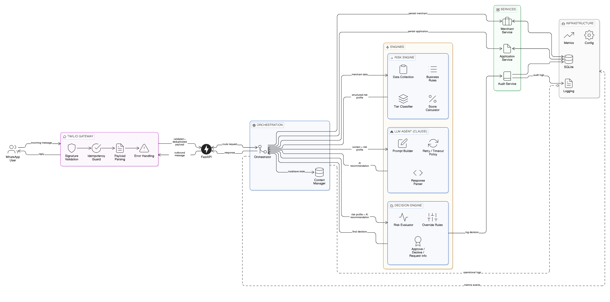


---
# grabon-ai-merchant-underwriting-agent

AI-powered Merchant Underwriting Agent using WhatsApp, deterministic risk scoring, and LLM-based reasoning.

---

## 🚀 Overview

This system processes merchant underwriting requests via WhatsApp and produces structured approval decisions using a hybrid architecture:

- Deterministic Risk Engine
- LLM-based reasoning (Claude)
- Centralized Decision Engine
- Service-layer persistence
- Structured logging and audit trail

The system is designed to be modular, scalable, and production-ready with strict separation of concerns.

---

## 🧠 High-Level Flow

1. Merchant sends a message via WhatsApp.
2. Twilio Gateway validates and deduplicates the webhook.
3. FastAPI receives the validated payload.
4. Orchestrator coordinates:
   - Context loading
   - Risk scoring
   - LLM recommendation
   - Final decision merge
5. Decision Engine determines final outcome.
6. Services persist data.
7. Messaging service sends response back to user.
8. Logs and metrics are emitted.

---

## 🏗 System Architecture

### 1️⃣ External Layer
- WhatsApp User

### 2️⃣ Gateway Layer
- Twilio Gateway
  - Signature Validation
  - Idempotency Guard
  - Payload Parsing
  - Error Handling

### 3️⃣ API Layer
- FastAPI Router

### 4️⃣ Orchestration Layer
- Orchestrator
- Context Manager

### 5️⃣ Engines Layer
- Risk Engine (deterministic scoring)
- LLM Agent (Claude)
  - Prompt Builder
  - Retry / Timeout Policy
  - Response Parser
- Decision Engine (single authority)

### 6️⃣ Service Layer
- Merchant Service
- Application Service
- Audit Service

### 7️⃣ Infrastructure Layer
- SQLite
- Logging
- Metrics
- Config

---

## 🎯 Decision Authority Model

Only the Decision Engine can:
- Approve
- Decline
- Request More Info

Risk Engine and LLM Agent only produce structured inputs.

This prevents distributed decision ambiguity and ensures auditability.

---

## 🧩 Core Components

### Orchestrator
Coordinates the underwriting lifecycle and controls execution flow.

### Risk Engine
Applies deterministic business rules and produces structured risk profiles.

### LLM Agent
Provides AI-based reasoning with retry and timeout handling.

### Decision Engine
Merges:
- Risk profile
- AI recommendation
- Business override rules

Produces final decision outcome.

### Context Manager
Maintains conversation state and underwriting session lifecycle.

---

## 🔒 Production Considerations

- Webhook idempotency protection
- Signature validation
- LLM retry and timeout policies
- Structured logging
- Persistent audit trail
- Clear separation of database responsibilities

---

## 🗂 Project Structure (Planned)

```
├── app/
│   ├── __init__.py
│   ├── main.py
│
│   ├── api/
│   │   ├── __init__.py
│   │   ├── routes.py
│   │   └── deps.py
│
│   ├── orchestrator/
│   │   ├── __init__.py
│   │   ├── orchestrator.py
│   │   └── context_manager.py
│
│   ├── engines/
│   │   ├── __init__.py
│   │   ├── risk_engine.py
│   │   ├── llm_agent.py
│   │   └── decision_engine.py
│
│   ├── services/
│   │   ├── __init__.py
│   │   ├── merchant_service.py
│   │   ├── application_service.py
│   │   ├── audit_service.py
│   │   └── messaging_service.py
│
│   ├── models/
│   │   ├── __init__.py
│   │   ├── merchant.py
│   │   ├── application.py
│   │   ├── risk_score.py
│   │   ├── message.py
│   │   └── audit_log.py
│
│   ├── schemas/
│   │   ├── __init__.py
│   │   ├── merchant_schema.py
│   │   ├── application_schema.py
│   │   ├── risk_schema.py
│   │   └── decision_schema.py
│
│   ├── db/
│   │   ├── __init__.py
│   │   ├── base.py
│   │   ├── session.py
│   │   └── init_db.py
│
│   ├── infrastructure/
│   │   ├── __init__.py
│   │   ├── config.py
│   │   ├── logging.py
│   │   └── metrics.py
│
│   └── core/
│       ├── __init__.py
│       ├── constants.py
│       └── exceptions.py
│
├── tests/
│   ├── __init__.py
│   └── test_placeholder.py
│
├── .env
├── .env.example
├── requirements.txt
├── README.md
└── alembic.ini
```
---

## 📎 Tech Stack

- Python 3.10+
- FastAPI
- SQLAlchemy
- SQLite
- Twilio
- Anthropic Claude API

---

## 🛠 Status

Phase 1: Architecture & Setup  
Phase 2: Core Engine Wiring & Implementation